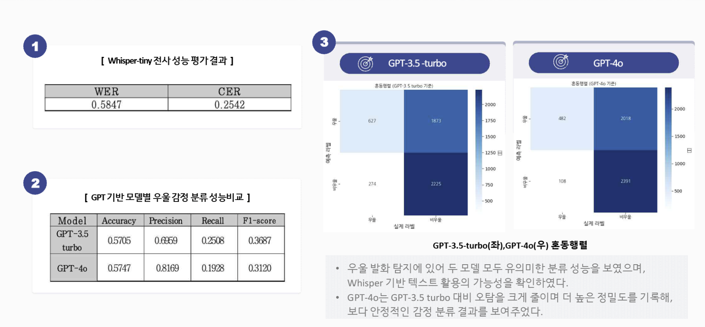

# stt-llm-depression-screening
Whisper 기반 STT 전처리 및 LLM 기반 우울 위험 스크리닝(비임상 연구)

## 1) 프로젝트 개요
- 목표: 정신건강 상담 음성 데이터를 전사(STT)하고, 텍스트 기반 감성/우울 위험을 **스크리닝 보조** 관점에서 분류
- 주의: 본 프로젝트는 **의료 진단이 아니며**, 연구/학습 목적의 비임상 실험입니다.

## 2) 사용 데이터
- AI Hub 복지상담(정신건강 상담) 음성 데이터 기반
- 개인정보/민감정보 보호를 위해 원본 데이터는 저장소에 포함하지 않습니다.

## 3) 방법(Pipeline)
1. 음성 데이터 전처리
2. Whisper 기반 STT 전사
3. 텍스트 정제 및 라벨 구성
4. LLM(GPT) 기반 분류/비교 실험 및 평가

## 4) 결과물
- 노트북: `LLM_우울증_조기진단_최종정리본.ipynb`
- 논문·학회 발표자료(PDF)는 개인정보 보호를 위해 저장소에 포함하지 않습니다 (요청 시 제공)

## 5) 실행 방법
### Option A) Colab(권장)
- (추가 예정) Colab 링크를 연결하면 별도 환경 설치 없이 실행 가능합니다.

### Option B) 로컬 실행
```bash
pip install -r requirements.txt
jupyter notebook
```

## 6) 실험결과
### Whisper-tiny: WER 0.5847 / CER 0.2542
분류 성능(표): GPT-3.5 turbo Acc 0.5705 / F1 0.3687, GPT-4o Acc 0.5747 / F1 0.3120


## 7) 발표 이후 재검증 (Post-hoc Validation)

학회 발표가 끝난 뒤 결과를 다시 확인하는 과정에서, **전사 단계가 의도대로 처리되지 않은 부분**이 있음을 발견했다. 이에 파이프라인을 처음부터 재점검했다.

### 재점검한 것
- **전사 품질**: Whisper-tiny 전사 결과를 정답 텍스트와 대조해 WER 0.5847 / CER 0.2542로 정량 측정 — 분류 입력으로 쓰기에 오류율이 높은 수준임을 확인
- **프롬프트 설계**: Zero-shot 분류 프롬프트가 전사 오류가 섞인 입력을 어떻게 처리하는지 재검토

### 재분석 결론
- 낮은 분류 성능(Acc 0.57대, F1 0.31~0.37)의 주요 원인 후보로 **상류(전사) 단계의 품질 저하**를 지목
- 교훈: 하류(분류) 성능을 보고하기 전에 상류(전사) 품질을 **독립적인 지표로 먼저 검증**해야 한다는 것 — 이후 프로젝트에서 파이프라인 각 단계의 품질을 개별 측정하는 습관의 계기가 됨

### 향후 개선 방향
- Whisper 상위 모델(base/small 이상)로 재전사 후 동일 조건 재실험
- 전사 오류 구간을 제외/보정한 입력으로 분류 성능 재측정 (전사 품질의 기여도 분리)
